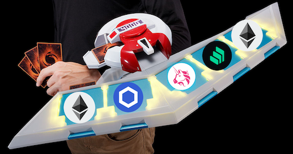
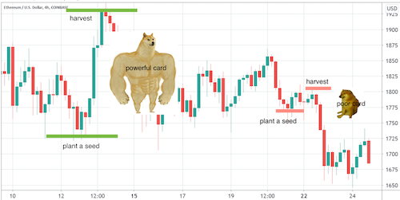
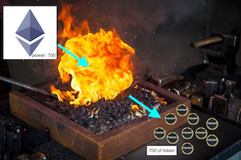

# JustaDuel
Ethereum game (#ChainlinkHackathon2021)  
Inspired by yu-gi-oh (a classic anime)
Base on chainlink-mix

  

---
## Summary
Print your own cards according to the price change of coins (using Chainlink price-feed oracle) instead of randomness. You'll get powerful cards if you're good at price prediction. Different type of cards (BASE, SWAP, LEND, LINK) cause different effects. Then you can duel with others using your self-printed cards. Your can earn duel-points by winning the duel or burn your cards (mint). You can also burn duel-points to enhance your card (forge).

---
## Plant Seed & Print Card
Choose a coin (ETH, LINK, UNI, COMP, etc) and Plant a seed at low price.  
After a while (maybe a long while :D), you can harvest and what you get is a card.  
The larger the increase of the coin price, the more powerful card you'll get.  
  

---
## Card & Token
With card you can duel with others.  
Or you just want to show how good is your price prediction :D  
With token you can enhance your card.  
If you don't want a card, you can burn it to get some token.  
The more powerful card your burn, the more token you'll get.  



---
## Run

1. Install ganache
```
$ npm install -g ganache-cli
```
2. Clone this project
```
$ git clone https://github.com/JustaJunk/JustaDuel.git
$ cd JustaDuel
```
3. Install python dependencies
```
$ pip install -r requirements.txt 
```
4. Compile smart contract
```
$ brownie compile --all
```
5. Run GUI (local blockchain)
```
$ brownie run gui
```
6. Run GUI (Kovan or Rinkeby)  

Create .env file in which set private key
```
PRIVATE_KEY=<your private key>
```
Set infura project ID
```
$ export WEB3_INFURA_PROJECT_ID=<your infura ID> // linux or mac
$ set WEB3_INFURA_PROJECT_ID=<your infura ID> // windows
```
Run gui
```
$ brownie run gui --network kovan
$ brownie run gui --network rinkeby
```

---
## Duel
Arrange yor card (at most 5) and duel with others.  
This is your card slot look like:  

BASE0 | SWAP | LEND | LINK | BASE1
-|-|-|-|-

Different type of card has different effect.  
1. **BASE0**: Basic power  
2. **SWAP**: Swap BASE0 if your UNI power larger than opponent's BASE0 power.  
3. **LEND**: Borrow BASE1 power from opponent with a ratio associated with your COMP power.  
4. **LINK**: Add BASE1 power to basic power with a ratio associated with your LINK power.  
5. **BASE1**: Linked by LINK card.

---
## TODO list
I'm a newbie to Dapp development (and English LUL)  
There are a lot to do :(  
1. Check smart contract security  
2. Front-end  
3. Artwork  
4. Use polygon or Solana to avoid extremely high gas fee  

---
## Contact me  
Any question or suggestion is so important to me.  
Feel free to contact me, which will help me a lot :)  
Discord: Justa#7359  
Telegram: @justajunk  
